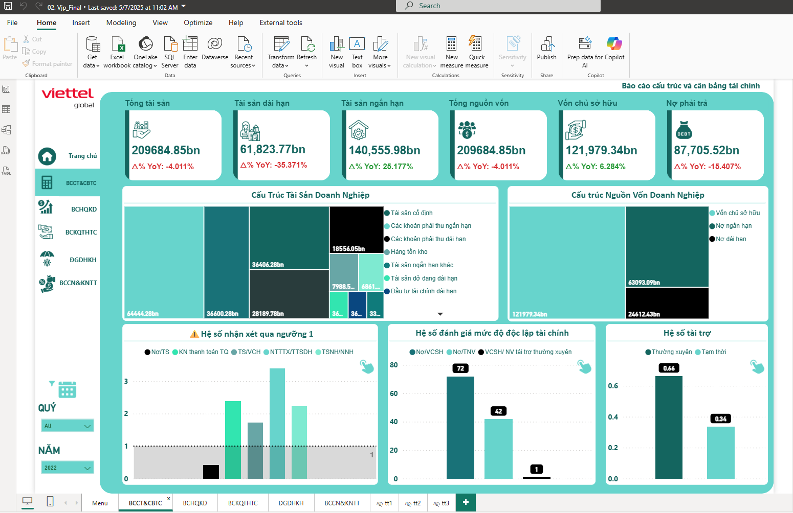
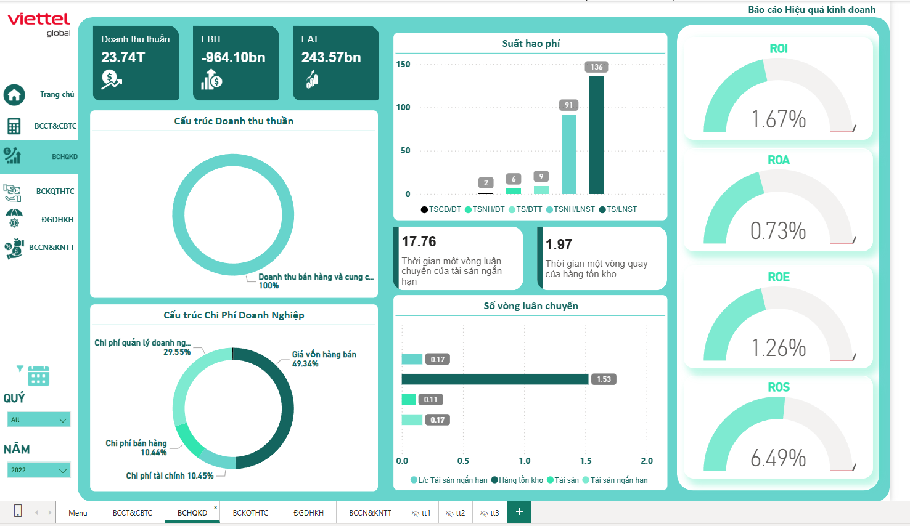

# Báo cáo tài chính Viettel Global
## Bach Viet Anh

## Dataset

- Viettel Global's financial reports (2017-2025): Financial Structure and Balance Report, Business Performance Report, General Financial Position Report, and Debt and Solvency Report.

## Step 
- Convert data to the appropriate format.
- Inserting data into SQL, cleaning, and merging data columns.
- Transfer data into Power BI Queries, filter out inappropriate data.
- Visual.
- Identify unique insights and discover causes.
- Propose hypotheses and make decisions.

